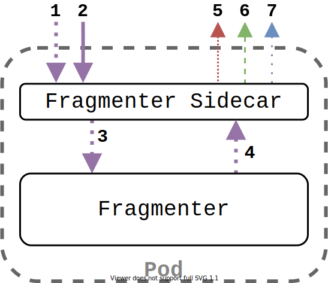

# Iterum Fragmenter Sidecar

---

If you haven't done so already, check out the [main repository](https://github.com/iterum-provenance/iterum) with introductory material.
Additionally, if you have not done so, this package has many dependencies on the shared library called [iterum-go](https://github.com/iterum-provenance/iterum-go). It contains shared/generalized dependencies of this fragmenter-sidecar, the [sidecar](https://github.com/iterum-provenance/sidecar) and the [combiner](https://github.com/iterum-provenance/combiner)

---

## General overview

The fragmenter-sidecar is an application that is attached to a fragmenter step in a pipeline. It acts as a decoupled interface between the user-provided fragmenter and the rest of the Iterum stack. It abstracts away from more complex topics such as message queue interaction and dealing with distributed storage in order to keep individual language libraries (such as [Pyterum](https://github.com/iterum-provenance/pyterum) as small as possible. The general flow of a fragmenter pod is shown in the image below, along with a more detailed explanation.

1. The sidecar pulls the target commit with metadata and file list from the Daemon
2. One by one, all files are downloaded to the sidecar and uploaded (step 5) to Minio
3. An array of strings is send to the fragmenter, containing all files in the commit of a data set
5. The fragmenter produces subfragments describing which files should be grouped together as a fragment
6. Whilst the user-defined fragmenter generates subfragments, the sidecar already uploads each file
7. Once all files associated with a subfragment are uploaded, a RemoteFragmentDesc is generated and lineage information about it is submitted to a message queue
8. The RemoteFragmentDesc is published as a message on the input channel of the next transformation step

---

## Fragmenter Sidecar structure

The fragmenter-sidecar itself consists of multiple smaller units wrapped up in goroutines. Each of them communicate with their dependents using channels. The type of messages are of `transmit.Serializable` such that the actual structured contents can be abstracted away from. Message contents varies between several types leading up to full fledged fragment description types (see the `data`-package for examples of these types).

The general application flow can be observed in `main.go`, though the implementation of each goroutine is somewhat more intricate. The implementation of many elements are shared and so stored in the shared `iterum-go` repo. For documentation on these see that repository.
This is how this fragmenter-sidecar links together these elements

1. Get the commit from the Daemon (`requests.go`)
2.  *a)* Download all config files for all tranformations from the Daemon using `ConfigDownloader`
    *b)* Subsequently, upload these files to a MinIO `config` bucket
3. `data.Mover` is responsible for downloading files from the Daemon and directly piping these into MinIO, notifying the `data.Tracker` of each uploaded file
4. The connection with the fragmenter is realized via a `Pipe`, consisting of 2 `Socket` instances. Sending the file-list form the commit, followed by a kill_message (meaning no more messages will arrive from the sidecar)
5. The fragmenter produces messages on the incoming channel of the pipe consisting of subfragments (`data/subfragment.go`). These are also send to the `data.Tracker`, on a separarate channel of the one found in `data.Mover`.
6. The user-defined Fragmenter concludes with a kill_message as well, indicating it will not produce any more messages.
7. The `data.Tracker` has 2 input channels, one for subfragments and one for uploaded files. It combines this information by tracking which subfragments have all files uploaded. Once all files of a subfragment are uploaded it produces a RemoteFragmentDescription and sends this to the `messageq.Sender`.
8. The `messageq.Sender`, publishes the messages on the MQ as input for subsequent transformations.
9. The `lineage.Tracker` also receives messages from the `messageq.Sender` and generates according lineage information and posts it on a separate channel 

---

## Code documentation

The documentation of code is left to code files themselves. They have been set up to work with Godoc, which can be achieved by running `godoc` and navigating to `http://localhost:6060/pkg/github.com/iterum-provenance/fragmenter-sidecar/`.